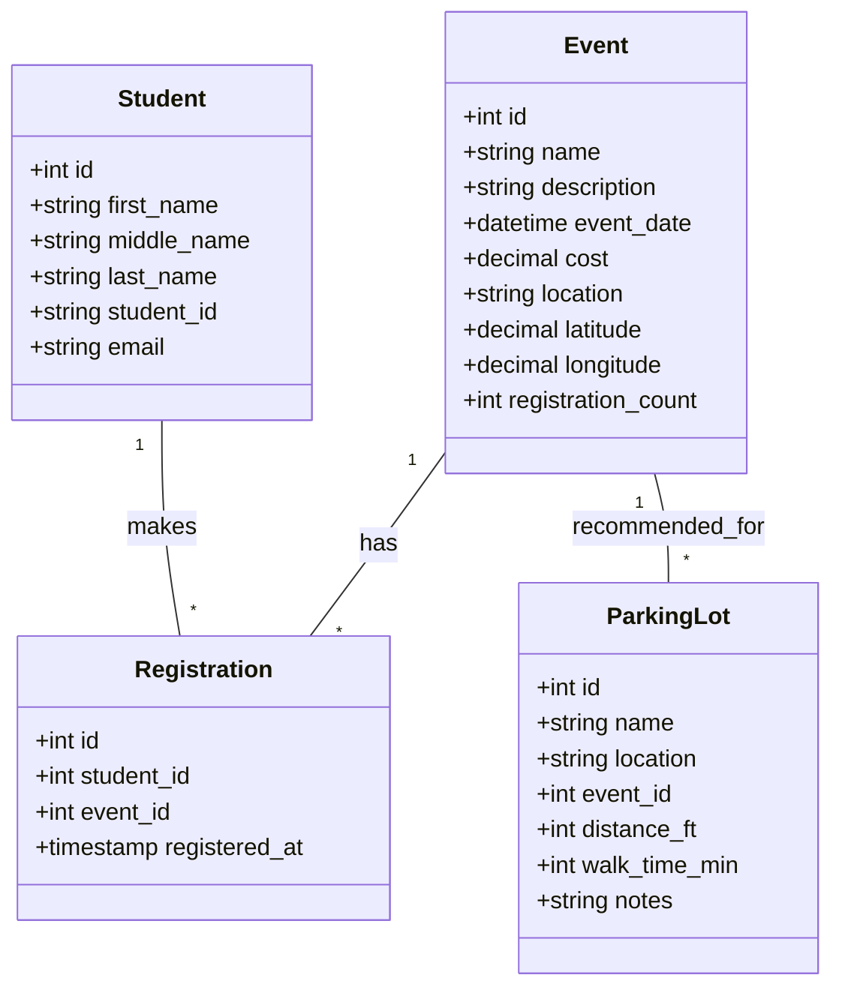
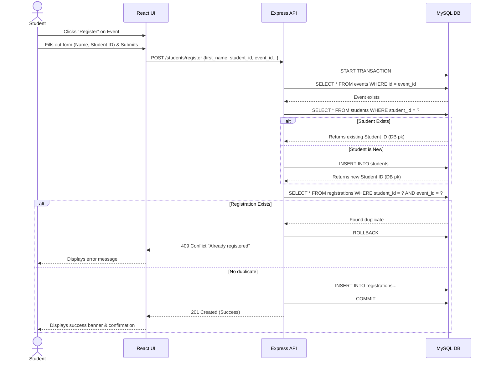
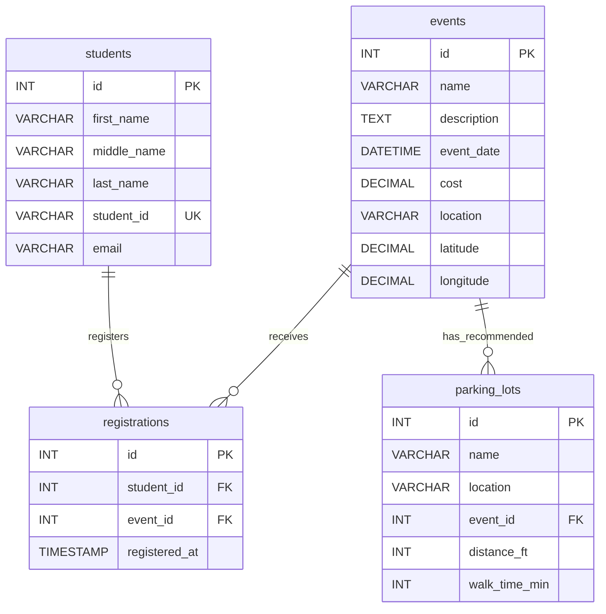

# PNW Student Life Event Management System — UML & Architecture

## 1. Use Case Diagram

**Actors:**
- **Student**: Can view events, view parking, calculate routes, register for events, and view their own dashboard.
- **System / Admin** *(Implied)*: Can create events via the POST API.

**Use Cases:**
1. **Browse Events**: Filter by date, search by name, sort results.
2. **View Event Details**: See cost, location, description, and attendance count.
3. **Register for Event**: Input name and student ID to reserve a spot.
4. **View My Dashboard**: Look up registered events by Student ID.
5. **Get Parking Info**: Automatically see recommended parking lots on an event's detail page.
6. **Calculate Route**: Input home address and event location to get driving directions via OSRM.

*(Visual generation: You can copy these use cases into a tool like Draw.io or Lucidchart to generate a visual use case diagram).*

---

## 2. Class Diagram (Models)

---

## 3. Sequence Diagram (Registration Flow)

---

## 4. Entity Relationship (ER) Diagram (Database)

---

## 5. Flowcharts

### Route Calculation Flow
1. **Start**: User navigates to `/routes`.
2. **Input**: User enters home address and event location.
3. **Submit**: React app calls `POST /routes/calculate`.
4. **Geocode 1**: Backend calls Nominatim API to convert home address to Lat/Lon.
5. **Geocode 2**: Backend calls Nominatim API to convert event location to Lat/Lon.
6. **Route Calculation**: Backend calls OSRM API with the two sets of coordinates.
7. **Process**: Backend extracts distance, duration, and GeoJSON polyline.
8. **Return**: API sends JSON back to frontend.
9. **Render**: React-Leaflet draws the polyline on the map and displays stats.
10. **End**.

### Parking Lookup Flow
1. **Start**: User navigates to an event detail page (`/events/:id`).
2. **Fetch Event**: React app calls `GET /events/:id`.
3. **Fetch Parking**: React app calls `GET /parking/:id`.
4. **DB Query**: Backend queries `parking_lots` where `event_id = :id`.
5. **Check Result**: 
   - *If lots found*: Return event-specific lots.
   - *If no lots found*: Query general campus lots (`event_id IS NULL`) and return those as fallback.
6. **Render**: React displays parking cards ordered by distance (closest first).
7. **End**.
